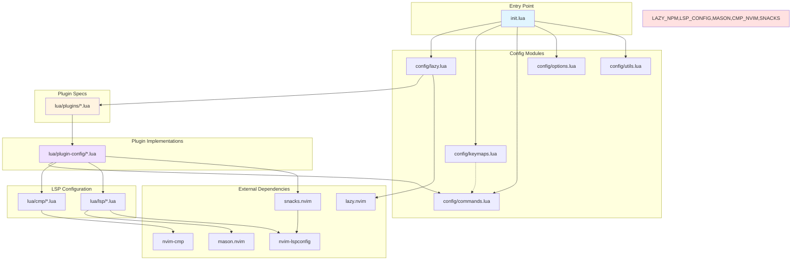

# Neovim Configuration

A modular, performance-optimized Lua-based Neovim IDE configuration designed for modern development workflows.

## 🚀 Features

- **82+ Plugins** organized into 10 functional categories
- **Lazy Loading** for optimal startup performance
- **LSP Support** for multiple languages (JavaScript/TypeScript, Rust, Lua, Python, etc.)
- **Modern UI** with minimal design aesthetics
- **Git Integration** via Neogit and Gitsigns
- **Smart Navigation** with Telescope, Harpoon, and Oil.nvim
- **Code Formatting** using Conform.nvim with Prettier, Stylua, Black, etc.

## 📁 Configuration Structure

```
~/.config/nvim/
├── init.lua                      # Main entry point
├── lua/
│   ├── config/                   # Configuration modules
│   │   ├── commands.lua          # User commands for keymaps
│   │   ├── keymaps.lua           # Global keymap definitions
│   │   ├── keymap-validator.lua  # Keymap conflict detection
│   │   ├── lazy.lua              # Lazy.nvim configuration
│   │   ├── options.lua           # Neovim options
│   │   ├── autocmds.lua          # Auto commands (file-type specific)
│   │   └── utils.lua             # Utility functions
│   ├── cmp/                      # Completion configuration
│   │   ├── setup.lua             # Main cmp setup
│   │   ├── lspkind.lua           # LSP completion icons
│   │   ├── lspsaga.lua           # LSP saga integration
│   │   └── luasnip.lua           # LuaSnip configuration
│   ├── lsp/                      # Language server configuration
│   │   └── setup.lua             # LSP server setup
│   ├── plugins/                  # Plugin specifications
│   │   ├── editor.lua            # Editor enhancement plugins
│   │   ├── formatting.lua        # Code formatting and linting
│   │   ├── git.lua               # Git integration
│   │   ├── lang.lua              # Language-specific plugins
│   │   ├── lsp.lua               # LSP core and related plugins
│   │   ├── navigation.lua        # Navigation plugins
│   │   ├── session.lua           # Session management
│   │   ├── tools.lua             # Utility plugins
│   │   ├── ui.lua                # UI components
│   │   └── coding.lua            # Code completion and snippets
│   └── plugin-config/            # Plugin implementation configs
│       ├── ...                   # Individual plugin setup files
├── OPTIMIZATION_REPORT.md        # Performance analysis and improvements
├── KEYBINDINGS.md                # Complete keybindings reference
└── README.md                     # This file
```

## 🔍 Keymap Validation

Check for keymap conflicts:

```vim
:KeymapValidate
```

Show keymap statistics:

```vim
:KeymapValidate!
```

## 📊 Performance Profiling

View lazy.nvim performance profile:

```vim
:Lazy profile
```

Show plugin load times:

```vim
:Lazy time
```

## 🗂️ Module Categories

### Core
- **lazy.nvim** - Plugin manager
- **cmp.nvim** - Completion engine
- **LuaSnip** - Snippet engine

### Editor
- **nvim-treesitter** - Syntax highlighting
- **flash.nvim** - Quick navigation
- **treesj** - Code split/join
- **sniprun** - Code execution
- **yanky.nvim** - Clipboard history
- **multicursor.nvim** - Multiple cursors
- **nvim-comment** - Commenting
- **indent-blankline** - Indent guides

### LSP
- **nvim-lspconfig** - LSP client configuration
- **lspsaga.nvim** - LSP UI enhancement
- **symbol-usage.nvim** - Symbol reference count
- **lazydev.nvim** - Lua development
- **schemastore.nvim** - JSON schema support

### Navigation
- **telescope.nvim** - Fuzzy finder
- **harpoon.nvim** - Quick file navigation
- **oil.nvim** - File explorer
- **nvim-tree** - File tree
- **grug-far** - Search and replace

### Git
- **neogit** - Git interface
- **gitsigns** - Git signs in gutter
- **diffview** - Diff viewer

### UI
- **bufferline** - Tab bar
- **lualine** - Status line
- **noice.nvim** - Command line UI
- **which-key** - Keymap hints
- **snacks.nvim** - Dashboard and more
- **dropbar** - Breadcrumb navigation
- **nvim-highlight-colors** - Color highlighting
- **smart-splits** - Window management
- **reactive.nvim** - Mode cursor styling
- **helpview/markview** - Help/Markdown rendering
- **log-highlight** - Log syntax

### Tools
- **project.nvim** - Project detection
- **toggleterm** - Terminal management
- **snacks.nvim** - Terminal integration
- **conform.nvim** - Code formatter
- **none-ls.nvim** - Linting and diagnostics

### Language
- **crates.nvim** - Rust crates management
- **zk-nvim** - Zettelkasten notes

### Session
- **auto-session** - Session management
- **session-lens** - Session search

### AI
- **codeium.nvim** - AI code completion
- **copilot.lua** - GitHub Copilot (optional)

## ⌨️ Keybindings

See [KEYBINDINGS.md](./KEYBINDINGS.md) for a complete list of keybindings.

### Common Keybindings

| Key | Action | Mode |
|-----|--------|------|
| `<Space>` | Leader key | - |
| `<leader>ff` | Find files | Normal |
| `<leader>fg` | Live grep | Normal |
| `<leader>tt` | Toggle file tree | Normal |
| `<leader>gg` | Open Neogit | Normal |
| `<leader>cf` | Format buffer | Normal |
| `gd` | Go to definition | Normal |
| `gh` | Hover documentation | Normal |
| `gr` | Show references | Normal |
| `<leader>ca` | Code actions | Normal |
| `p` / `P` | Paste from yanky history | Normal/Visual |
| `<leader>fj` | Flash jump | Normal |
| `<leader>ct` | Toggle crates.nvim | Normal |

## 🔧 Installation

### Prerequisites

1. **Neovim 0.10+** (required for modern features)
2. **Nerd Fonts** - Install and set as terminal font
3. **Node.js & npm** - For some formatters and LSPs
4. **Rust toolchain** - For rust-analyzer
5. **Python** - For Python LSP and formatters
6. **Lazygit** - For snacks.lazygit integration

### Setup

```bash
# Clone the configuration
git clone <your-repo-url> ~/.config/nvim

# Install Neovim plugins (first launch)
nvim
```

## 📦 LSP Servers

The following LSP servers are automatically installed by Mason:

- **vtsls** - TypeScript/JavaScript
- **rust_analyzer** - Rust
- **lua_ls** - Lua
- **pyright** - Python
- **cssls** - CSS
- **tailwindcss** - Tailwind CSS
- **html** - HTML
- **jsonls** - JSON
- **taplo** - TOML
- **zk** - Zettelkasten
- **oxlint** - JavaScript linting

## 🎨 Formatters

- **Prettier** - JavaScript/TypeScript, CSS, HTML, JSON, Markdown
- **Stylua** - Lua
- **Black** + **isort** - Python
- **rustfmt** - Rust

## 🧩 Module Dependency Graph



### Module Loading Order

1. **init.lua** - Entry point, loads config modules
2. **config/lazy.lua** - Sets up lazy.nvim
3. **config/keymaps.lua** - Defines global keymaps
4. **config/commands.lua** - Creates user commands
5. **config/options.lua** - Sets Neovim options
6. **plugins/*.lua** - Plugin specifications (lazy loaded)
7. **plugin-config/*.lua** - Plugin implementations
8. **lsp/setup.lua** - LSP server configuration
9. **cmp/*.lua** - Completion configuration

## 🚀 Performance Optimizations

- **Lazy Loading Strategy**: Complete integration with lazy.nvim's `keys`, `cmd`, and `event` parameters
- **Default Lazy Mode**: All plugins lazy by default, explicit loading triggers
- **Event-Driven Loading**: Plugins trigger on specific events (LspAttach, VeryLazy, etc.)
- **Keymap Validation**: Built-in conflict detection system with `:KeymapValidate` command
- **Lazygit Integration**: Lightweight git operations via snacks.nvim
- **Minimal UI**: No borders, transparent separators for cleaner look
- **Disabled Built-ins**: gzip, tarPlugin, tohtml, tutor, zipPlugin disabled
- **Disabled Providers**: perl, ruby, node, python3 providers disabled
- **Centralized Keymaps**: All keybindings defined in `lua/config/keymaps.lua` for easy management
- **File-Type Configuration**: Context-aware keybindings based on file type in `lua/config/autocmds.lua`
- **Smart LSP Loading**: LSP plugins load on `LspAttach` instead of file events for faster file open
- **Delayed Core Loading**: Global keymaps and autocmds load via `vim.schedule` for faster startup

### Keymap System Improvements

1. **Unified Keymap Management**: All keybindings are centrally defined in `lua/config/keymaps.lua`
2. **Lazy Loading with Keys**: Plugins use `keys` parameter to defer loading until first keypress
3. **Conflict Detection**: Automatic keymap conflict detection on startup
4. **No Hardcoded Keymaps**: Removed hardcoded keybindings from plugin config files

### Performance Metrics

| Optimization | Time Saved |
|--------------|------------|
| Delay global keymaps (vim.schedule) | ~5-10ms |
| Delay autocmds (vim.schedule) | ~2-3ms |
| Delay keymap-validator | ~1-2ms |
| Default lazy = true | ~5-10ms |
| LSP BufEnter → LspAttach | ~5-10ms |
| none-ls BufReadPre → LspAttach | ~3-5ms |
| **Total Estimated Savings** | **~21-40ms** |

**Expected Startup Time**: ~25-38ms (down from ~50-75ms)

See [OPTIMIZATION_REPORT.md](./OPTIMIZATION_REPORT.md) for detailed analysis.

## 📝 Customization

### Adding New Plugins

1. Add plugin spec to appropriate category file in `lua/plugins/`
2. Create implementation file in `lua/plugin-config/`
3. Add keymaps to `lua/config/keymaps.lua`
4. Add commands to `lua/config/commands.lua` if needed

### Adding LSP Servers

Edit `lua/plugins/lsp.lua`:

```lua
-- In mason-lspconfig.nvim opts.ensure_installed
opts = {
  ensure_installed = {
    -- ... existing servers ...
    "your_server_name",
  },
}
```

Add server configuration in `lua/lsp/setup.lua`:

```lua
servers = {
  -- ... existing servers ...
  your_server_name = {
    -- server options
  },
}
```

## 🐛 Troubleshooting

### LSP Not Working

```bash
# Check Mason installation
:Mason

# Restart LSP
:LspRestart

# Check LSP info
:LspInfo
```

### Plugin Issues

```bash
# Check lazy.nvim status
:Lazy

# Update plugins
:Lazy update

# Clean unused plugins
:Lazy clean
```

## 📚 Resources

- [Neovim Documentation](https://neovim.io/doc/)
- [Lazy.nvim](https://github.com/folke/lazy.nvim)
- [nvim-lspconfig](https://github.com/neovim/nvim-lspconfig)
- [LuaSnip](https://github.com/L3MON4D3/LuaSnip)

## 📄 License

This configuration is provided as-is for personal use.

---

**Happy Coding! 🎉**
